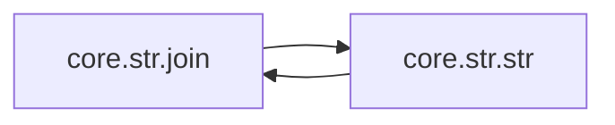

# Core Str

[_Documentation generated by Documatic_](https://www.documatic.com)

<!---Documatic-section-Codebase Structure-start--->
## Codebase Structure

<!---Documatic-block-system_architecture-start--->
```mermaid
None
```
<!---Documatic-block-system_architecture-end--->

# #
<!---Documatic-section-Codebase Structure-end--->

<!---Documatic-section-core.str.str-start--->
## [core.str.str](3-core_str.md#core.str.str)

<!---Documatic-section-str-start--->


### Object Calls

* [core.str.join](3-core_str.md#core.str.join)

<!---Documatic-block-core.str.str-start--->
<details>
	<summary><code>core.str.str</code> code snippet</summary>

```python
@native
def str(value: Integer) -> String:
    pass
```
</details>
<!---Documatic-block-core.str.str-end--->
<!---Documatic-section-str-end--->

# #
<!---Documatic-section-core.str.str-end--->

<!---Documatic-section-core.str.join-start--->
## [core.str.join](3-core_str.md#core.str.join)

<!---Documatic-section-join-start--->


### Object Calls

* [core.str.str](3-core_str.md#core.str.str)

<!---Documatic-block-core.str.join-start--->
<details>
	<summary><code>core.str.join</code> code snippet</summary>

```python
@gen(t)
def join(separator: String, values: [t]) -> String:
    out = ''
    for value in values[:-1]:
        out += str(value) + separator
    return out + str(values[-1])
```
</details>
<!---Documatic-block-core.str.join-end--->
<!---Documatic-section-join-end--->

# #
<!---Documatic-section-core.str.join-end--->

[_Documentation generated by Documatic_](https://www.documatic.com)